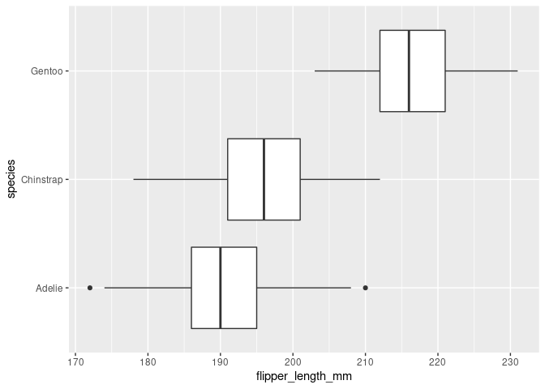
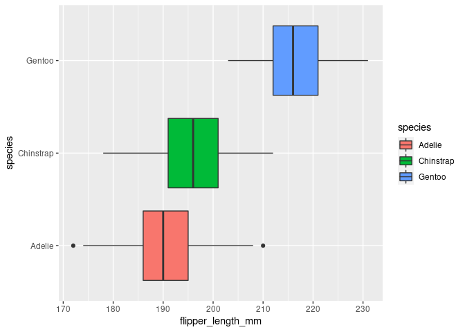

Activity 2
================
Stella

In the R code chunk below, I am setting a global option for this `.Rmd`
report. For the time being you can, “pay not attention to the code
between lines 10 and 12.”

## Data and packages

Data were collected and made available by [Dr. Kristen
Gorman](https://www.uaf.edu/cfos/people/faculty/detail/kristen-gorman.php)
and the [Palmer Station, Antarctica LTER](https://pal.lternet.edu/) (a
member of the [Long Term Ecological Research
Network](https://lternet.edu/)). Drs. [Allison
Horst](https://allisonhorst.github.io/) and [Alison
Hill](https://alison.rbind.io/) packaged these data into
[`{palmerpenguins}`](https://allisonhorst.github.io/palmerpenguins/).
The `penguins` data set contains the following variables:


All artwork by \[@allison\_horst\](<https://twitter.com/allison_horst>).

-   `species`: a factor denoting penguin species (Adélie, Chinstrap and
    Gentoo)
-   `island`: a factor denoting island in Palmer Archipelago, Antarctica
    (Biscoe, Dream or Torgersen)
-   `bill_length_mm`: a number denoting bill length (millimeters)
-   `bill_depth_mm`: a number denoting bill depth (millimeters)
-   `flipper_length_mm`: an integer denoting flipper length
    (millimeters)
-   `body_mass_g`: an integer denoting body mass (grams)
-   `sex`: a factor denoting penguin sex (female, male)
-   `year`: an integer denoting the study year (2007, 2008, or 2009)

We will need to install `{palmerpenguins}` in your RStudio session to be
able to use this. There are a couple of ways to do this, but my
preferred method is to type the following in your **Console** pane (this
should be the pane below this open `.Rmd` file). Note that you should
only ever type this in your Console (this should not be included in any
R Markdown files).

    install.packages("palmerpenguins")

After a brief amount of time, your Console should display:

    Installing package into ‘/home/{studentid}/R/x86_64-pc-linux-gnu-library/4.1’
    (as ‘lib’ is unspecified)
    trying URL 'https://cran.rstudio.com/src/contrib/palmerpenguins_0.1.0.tar.gz'
    Content type 'application/x-gzip' length 2987721 bytes (2.8 MB)
    ==================================================
    downloaded 2.8 MB

    * installing *source* package ‘palmerpenguins’ ...
    ** package ‘palmerpenguins’ successfully unpacked and MD5 sums checked
    ** using staged installation
    ** R
    ** data
    *** moving datasets to lazyload DB
    ** inst
    ** byte-compile and prepare package for lazy loading
    ** help
    *** installing help indices
    *** copying figures
    ** building package indices
    ** testing if installed package can be loaded from temporary location
    ** testing if installed package can be loaded from final location
    ** testing if installed package keeps a record of temporary installation path
    * DONE (palmerpenguins)

    The downloaded source packages are in
        ‘/tmp/Rtmp1DEb9z/downloaded_packages’

You can verify that this package has been installed (and view the other
packages that are already installed) using the RStudio IDE. First, in
the **Files** pane, click on the **Packages** tab. Then, either scroll
or search for `palmerpenguins`. Note that this tab is another place
where you can install packages. In practice, you install a package once
(or each time an update is made), then load it (using `library`) each
time you start RStudio.

In the code chunk below, I load the package, and show a snippet of the
`penguins` dataset.

``` r
library(palmerpenguins)
penguins
```

    ## # A tibble: 344 x 8
    ##    species island    bill_length_mm bill_depth_mm flipper_length_mm body_mass_g
    ##    <fct>   <fct>              <dbl>         <dbl>             <int>       <int>
    ##  1 Adelie  Torgersen           39.1          18.7               181        3750
    ##  2 Adelie  Torgersen           39.5          17.4               186        3800
    ##  3 Adelie  Torgersen           40.3          18                 195        3250
    ##  4 Adelie  Torgersen           NA            NA                  NA          NA
    ##  5 Adelie  Torgersen           36.7          19.3               193        3450
    ##  6 Adelie  Torgersen           39.3          20.6               190        3650
    ##  7 Adelie  Torgersen           38.9          17.8               181        3625
    ##  8 Adelie  Torgersen           39.2          19.6               195        4675
    ##  9 Adelie  Torgersen           34.1          18.1               193        3475
    ## 10 Adelie  Torgersen           42            20.2               190        4250
    ## # … with 334 more rows, and 2 more variables: sex <fct>, year <int>

While I believe that most of the variables are relatively
self-explanatory, we should still make sure we understand what
information we have. Type the following in your **Console** to view the
help documentation for the `penguins` dataset: `?penguins`. This should
also only ever be typed in your Console (not included in an R Markdown
file).

Update the list of variables that I provided above (i.e., lines 24-31)
to provide descriptions of each of the variables.

The image below show how bill length and bill depth were measured.


Beyond `{palmerpenguins}` we will also need `{ggplot2}` for creating
visualizations.

``` r
library(ggplot2)
```

## Analysis

### Explore Distributions

Below is a comparative boxplots for the distribution of
`flipper_length_mm` for the three `species`.

``` r
ggplot(data = penguins, mapping = aes(x = flipper_length_mm, y = species)) +
  geom_boxplot()
```

    ## Warning: Removed 2 rows containing non-finite values (stat_boxplot).

<!-- -->

From your preparations, you saw that you can add color to plots by
mapping a variable to one of the color aesthetics. For this boxplot, we
want to double-encode the variable `species` to not only the `y` axis,
but also the `fill` aesthetic. In the code chunk below, add the missing
code (i.e., replacing the `___`) to have our comparative boxplots also
include some coloring.

``` r
ggplot(data = penguins, mapping = aes(x = flipper_length_mm, y = species, fill = species)) +
  geom_boxplot()
```

    ## Warning: Removed 2 rows containing non-finite values (stat_boxplot).

<!-- -->

Now, comment on what you notice from these boxplots.

**Response**: each species is assigned it’s own color.

Another way to visualize distributions are with points. You may have
heard of dotplots before (one-dimensional scatterplots). We can create
something similar with jitterplots using `geom_jitter`. In the code
chunk below, complete it so that it produces a jitterplot.

``` r
ggplot(data = penguins, mapping = aes(x = flipper_length_mm, y = species, color = species)) +
  geom_jitter()
```

    ## Warning: Removed 2 rows containing missing values (geom_point).

<!-- -->

Comment on the strengths of the boxplot compared to the jitterplot and
vice versa. That is, what can you easily determine by looking at the
boxplot? What about the jitterplot?

**Response**: Box plot allows you to identify the spread of the data set
and where the quartiles lie.

Knit, then stage everything listed in your **Git** pane, commit (with a
meaningful commit message), and push to your GitHub repo. Then, go to
GitHub and compare/contrast your `activity02-ggplot2-intro.Rmd` and
`activity02-ggplot2-intro.md` files. Which is easier to read? Which
looks more professional?

**Response**: The markdown is easier to read and looks more
proffesional.

Now, wouldn’t it be nice if we could combine these two plots so that we
get the benefits of both!?! That is, how can we overlay the jitterplot
over the boxplot? Try doing the following in the code chunk below with
my *hint*:

-   Re-create the boxplot with color that you did above, then
-   *Add* another geometry layer for the jitterplot.

``` r
ggplot(data = penguins, mapping = aes(x = flipper_length_mm, y = species, fill = species)) +
  geom_boxplot() +
  geom_jitter()
```

    ## Warning: Removed 2 rows containing non-finite values (stat_boxplot).

    ## Warning: Removed 2 rows containing missing values (geom_point).

<!-- -->

Play around with doing the jitterplot laid over the boxplot and the
boxplot laid over the jitterplot. Which do you prefer? Why?

**Response**: jitter over the boxplot as the boxes would cover the
points.

This is getting us closer to one of my favorite plots - the raincloud
plot. We are not quite ready to create this plot, but we will get there
eventually!


Suppose that you wanted to only color the points in your combined plot,
but not the individual boxplots - you want the boxplots to be the
default white coloring. In the code chunk below, explore different
methods to try to create this plot. A hint, all `geom_*` have a
`mapping` argument.

``` r
ggplot(data = penguins, mapping = aes(x = flipper_length_mm, y = species)) +
  geom_boxplot() +
  geom_jitter(mapping = aes(color=species))
```

    ## Warning: Removed 2 rows containing non-finite values (stat_boxplot).

    ## Warning: Removed 2 rows containing missing values (geom_point).

<!-- -->

In the above code chunk, continue to play around with having the
aesthetics mapped in the different layers. For example, how does having
all of them mapped in the `ggplot` call compared to having these instead
mapped in the `geom_boxplot` layer? Comment on what you notice.

**Response**: you can map to individual layers vs applying the aesthetic
to all layers

Knit, then stage everything listed in your **Git** pane, commit (with a
meaningful commit message), and push to your GitHub repo. Go to GitHub
and verify that your `activity02-ggplot2-intro.Rmd` file appears as you
intended it to.

### Exploration

Below is a histogram with a smoothed density (think proportion) area
curve behind it. I had to do a “trick” in my histogram layer to put both
of these plots on the same y-axis scale, but we will ignore that for the
time being. There appear to be two noticeable peaks in the distributions
of bill lengths: one around 39 mm and one around 46 mm.


Create graphs to explore the relationship between `bill_length_mm` and
each of `species`, `sex`, and `island` (you should have three total
graphs). Using these three graphs to discuss which of these three
categorical variables seems to be contributing more to these two peaks
and explain your reasoning.

**Response**:

Knit, then stage everything listed in your **Git** pane, commit (with a
meaningful commit message), and push to your GitHub repo. Go to GitHub
and verify that your `activity02-ggplot2-intro.Rmd` file appears as you
intended it to.

### Scatterplots

You created some scatterplots in Preparation 3. Here we continue
exploring scatterplots using `{ggplot2}`.

In the code chunk below, create a scatterplot for the relationship
between `flipper_length_mm` and `body_mass_g`.

Describe any patterns that you notice.

**Response**:

Recreate your scatterplot in the code chunk below; however, *map*
`species` to the `color` and `shape` aesthetics.

Describe any patterns that you notice.

**Response**:

The previous plot looked great except even in this rather small dataset
(n = 344), there might are a number of points overlapping. In the R code
chunk below, *set* the values (instead of mapping a variable to an
aesthetic) of `size` (using some value larger than zero) and `alpha`
(using some value between 0 and 1) to make your previous plot more
effective.

Discuss the decisions you made to help your plot be easier to read.

**Response**:

Knit, then stage everything listed in your **Git** pane, commit (with a
meaningful commit message), and push to your GitHub repo. Go to GitHub
and verify that your `activity02-ggplot2-intro.Rmd` file appears as you
intended it to.

You can now go back to the `README` file.
